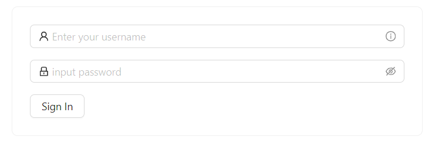
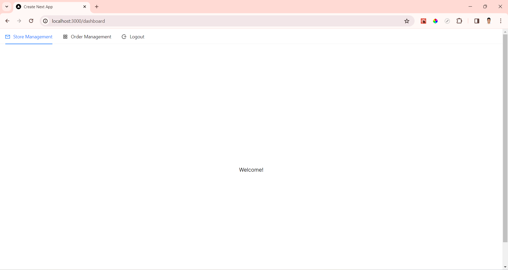
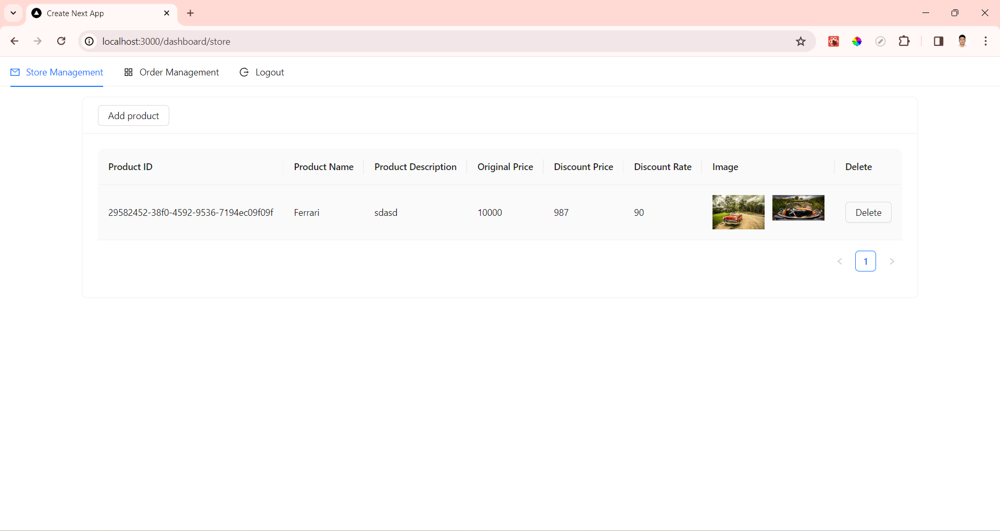
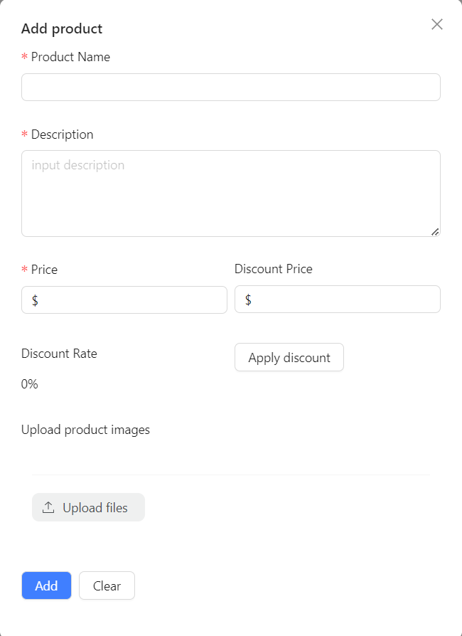

# s1mple-shop-admin

## Description
* This is a simple admin dashboard for a shop.
* Technology stack: 


## Project setup

### Install dependencies

```
npm install
```

### Compiles and hot-reloads for development
```
npm run dev
```

Now the application is running on ```http://localhost:3000/```

## Interface

#### Login

Username: ***0867997139***

Password: ***123***




#### Dashboard



#### Store management





#### Orders management

***! This function is under development***
